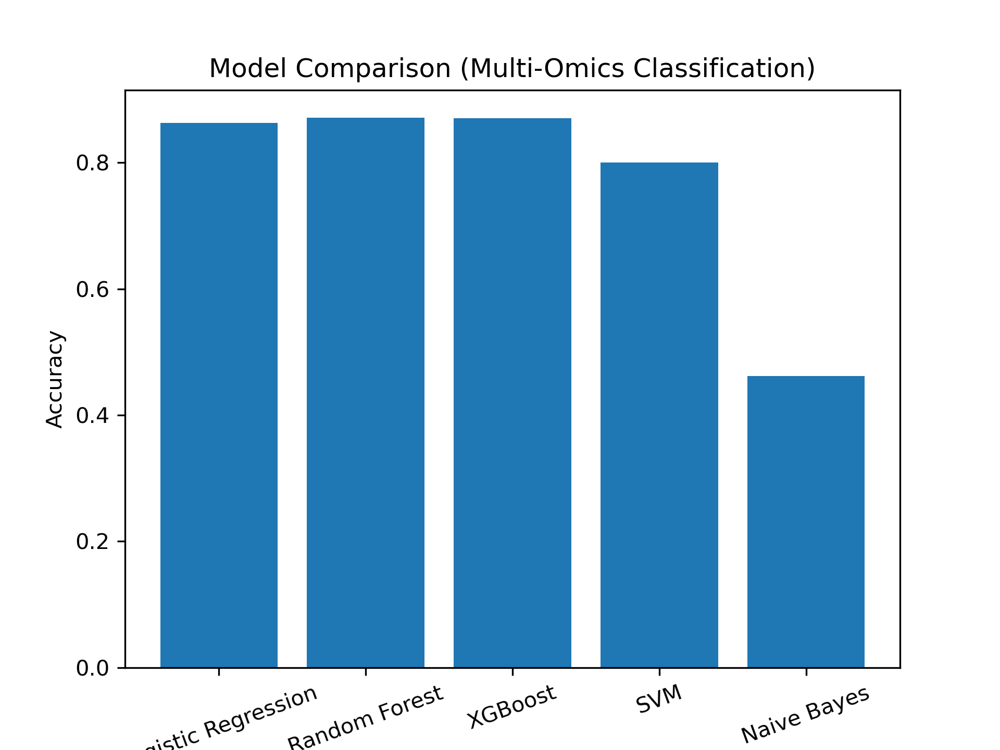

# 🧠 Alzheimer’s Detection using Multi-Omics Integration & Machine Learning

## 📌 Overview

This project focuses on detecting **Alzheimer’s Disease (AD)** by integrating **Gene Expression (GE)** and **DNA Methylation (DM)** data using a multi-omics approach.

We applied **autoencoder-based dimensionality reduction** and a **pairwise integration strategy**, followed by machine learning models for classification.

---

## 🚀 Key Features

* 🔬 Multi-omics data integration (GE + DM)
* 🧠 Autoencoder-based feature extraction
* 🔗 Pairwise integration of biological data
* ⚠️ Data leakage identification and correction
* 📊 Comparative analysis of ML models
* 📈 Visualization using graphs and confusion matrix

---

## 📂 Dataset

* Gene Expression datasets:

  * GSE33000
  * GSE44770
* DNA Methylation dataset:

  * GSE80970

---

## ⚙️ Methodology

### 1️⃣ Preprocessing

* Data cleaning and label extraction
* Conversion to numerical format
* Merging GE datasets

### 2️⃣ Train-Test Split

* 70–30 stratified split
* Avoided data leakage

### 3️⃣ Feature Reduction (Autoencoder)

* GE: **39280 → 64 features**
* DM: **485577 → 16 features**

### 4️⃣ Pairwise Integration

* Combined GE and DM features based on matching class labels
* Final feature vector: **80 features**

### 5️⃣ Leakage Fix

* Ensured train and test pairing were done separately
* Prevented overlap between datasets

---

## 🤖 Models Used

* Logistic Regression
* Random Forest ⭐
* Support Vector Machine (SVM)

---

## 📊 Results

| Model               | Accuracy |
| ------------------- | -------- |
| Logistic Regression | 86.35%   |
| Random Forest       | ⭐ 87.17% |
| XGBoost             | 87.06%   |
| SVM                 | 80.01%   |
| Naive Bayes         | 46.20%   |

---

## 📈 Model Comparison

---

## 🏆 Key Insights

* **Random Forest and XGBoost performed best**, showing strong capability in handling nonlinear high-dimensional data
* Logistic Regression achieved competitive performance
* SVM showed moderate performance
* Naive Bayes performed poorly due to its assumption of feature independence, which is not suitable for multi-omics data

---

## 🧠 Conclusion

This study demonstrates that **ensemble-based models outperform simpler models** for multi-omics Alzheimer’s classification.

The combination of:

* Autoencoder-based feature reduction
* Multi-omics integration
* Ensemble learning

leads to improved prediction performance.

---

## 📌 Future Work

* Apply advanced deep learning models
* Use larger datasets
* Explore feature selection techniques
* Perform robust cross-validation

---

## 👩‍💻 Author

**Shibangini Kar**
B.Tech CSE | Final Year Project

---
